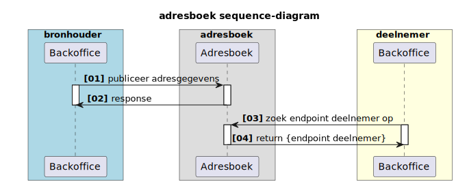

# RFC0003 - Adresboek

**SAMENVATTING**

Dit document beschrijft de wijze waarop het adresboekbinnen het iWlz-netwerkmodel wordt geïmplementeerd.

---
**Inhoudsopgave**
- [RFC0003a - Adresboek](#rfc0003a---adresboek)
- [1. Inleiding](#1-inleiding)
  - [1.1 Uitgangspunten](#11-uitgangspunten)
- [2. Terminologie](#2-terminologie)
- [3. Functionaliteiten](#3-functionaliteiten)
- [4. Services](#4-services)
  - [4.1 Publiceren](#41-publiceren)
  - [4.2 Raadplegen](#42-raadplegen)
- [5 Foutmeldingen](#5-foutmeldingen)

---
# 1. Inleiding
>```Inleiding```
Binnen het iWLZ-netwerk worden gegevens uitgewisseld via REST-services (GraphQL), hierbij speelt het Adresboek een cruciale rol bij het faciliteren van het ontdekken en communiceren met beschikbare gegevensdiensten binnen het netwerk. Het fungeert als een register dat informatie bijhoudt over verschillende gegevensdiensten die worden aangeboden door verschillende netwerkdeelnemers. Het primaire doel van het adresboek is om gebruikers van gegevensbronnen in staat te stellen de juiste services te vinden, begrijpen en verbinden om aan hun behoeften te voldoen.

Informatie rodnom de diverse abonnementen en notificatietypen die per register beschikbaar zijn wordt vastgelegd in de [Dienstencatalogus](RFC0016 - Service directory.md).

## 1.1 Uitgangspunten
- Het adresboek is uitsluitend toegankelijk voor netwerkdeelnemers.

# 2. Terminologie
Opsomming van de in dit document gebruikte termen.

| Terminologie | Omschrijving |
| -------- | :-------- | 

# 3. Functionaliteiten
De belangrijkste functionaliteiten van het Adresboek zijn:

1. Service Registratie: Gegevensbronnen registreren hun services bij het adresboek en verstrekken essentiële informatie over de service, zoals de naam, beschrijving, eindpunt-URL, ondersteunde operaties, invoer/uitvoerformaten, verificatievereisten en andere relevante metadata.

2. Service Discovery: Netwerkdeelnemers kunnen het adresboek bevragen om beschikbare services te ontdekken die aan hun specifieke behoeften voldoen. Ze kunnen zoeken naar services op basis van verschillende criteria, zoals de identiteit van de netwerkwerkdeelnemer of registertype.

3. Service Metadata en Documentatie: het adresboek biedt aanvullende details en documentatie over elke geregistreerde service, zodat netwerkdeelnemers de mogelijkheden, gebruiksrichtlijnen, invoer/uitvoerformaten en eventuele specifieke vereisten of beperkingen kunnen begrijpen.

4. Service Eindpuntresolutie: Bij het ontdekken van een gewenste service helpt het adresboek consumenten om de juiste eindpunt-URL te verkrijgen die nodig zijn om effectief met de service te communiceren.

Over het algemeen fungeert het adresboek als een centrale hub die netwerkdeelnemers in staat stelt hun services te publiceren EN afnemers van gegevens in staat stelt om de juiste services te ontdekken. Het vereenvoudigt het proces van integratie en orchestratie binnen het iWLZ-netwerk, en bevordert interoperabiliteit en efficiënte gegevensuitwisseling.

# 4. Gegevens
Uitgaande van de structuur van het ZorgAdresboek van VZVZ worden bji een organisatie de volgende gegevens met betrekking tot technische adressering vastgelegd.

| Gegeven | Omschrijving | Voorbeeld                      |
|:-----------------|:----------------------|:----------------------------------------|
| Type  | Type elektronische dienst | "iWLZ Indicatieregister" |
| Active  | Geeft aan of deze elektronische dienst actief is | "TRUE" |
| Value  | ID van de elektronische dienst, bijvoorbeeld ‘000000001’ | “00001” |
| Address  | Adres (endpoint) van de elektronische dienst | “https://netwerkpunt.ciz.nl/indicatie” |
| Description  | Beschrijving van de elektronische dienst | "Endpoint voor het afhandelen van graphQL requests"               |

# 4. Services
Het adresboek bevat services voor het publiceren en ophalen van informatie over de diverse deelnemers binnen het iWLZ-netwerk.



<details>
  <summary>plantUML-source</summary>

  ```plantuml
      @startuml
title adresboek sequence-diagram
  skinparam handwritten false
  skinparam participantpadding 20
  skinparam boxpadding 40
  autonumber "<b>[00]"
  
box bronhouder #lightblue
  participant "Backoffice" as bs
  end box

  box adresboek
  participant "Adresboek" as ab
  end box

  box deelnemer #lightyellow
  participant "Backoffice" as dnp
  end box

    bs -> ab : publiceer adresgegevens
    activate ab
    activate bs
    ab -> bs : response
    deactivate bs
    deactivate ab

    dnp -> ab: zoek endpoint deelnemer op

    activate ab
    activate dnp
    ab -> dnp: return {endpoint deelnemer}
    deactivate ab
deactivate dnp
@enduml
  ```
</details>

## 4.1 Publiceren
REST request voor het publiceren van een service in het Zorg-AB
```http
POST https://{baseURL}/zab/organizations/1/electronicServices
```
Voorbeeld body:
```json
{
  "type": "iWLZ Indicatieregister",
  "active": true,
  "value": "00001",
  "address": "https://netwerkpunt.ciz.nl/indicatie",
  "description": "Endpoint voor het afhandelen van graphQL requests"
}
```
succesvol response: 
```http
HTTP/1.1 201
```

## 4.2 Raadplegen
REST request voor het zoeken van een organisatie, bijvoorbeeld op AGB code:
```http
GET https://{baseURL}/zab/organizations?search={agbCode}
```

Voorbeeld response:
```json
[
  {
    "_self": "sample _self",
    "_className": "sample _className",
    "_id": "sample _id",
    "addresses": [],
    "telecoms": [],
    "identifications": [],
    "credentials": [],
    "electronicServices": [],
    "attachments": [],
    "speciality": "sample speciality",
    "comment": "sample comment",
    "types": [],
    "timestamp": "sample timestamp",
    "names": [],
    "type": [
      "sample type"
    ],
    "applicationIds": [
      "sample applicationIds"
    ],
    "ura": "sample ura",
    "displayName": "sample displayName"
  }
]
```

# 5 Foutmeldingen
400
401
404
