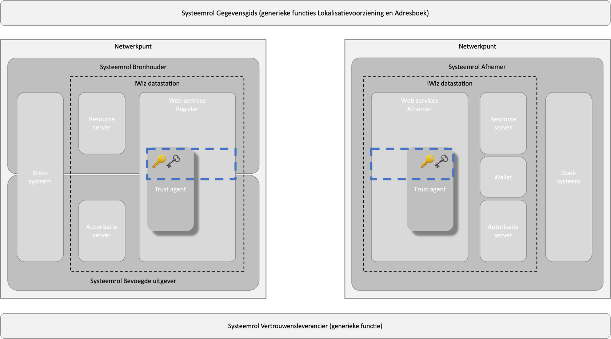

# RFC0013 - Identiteit

**SAMENVATTING**

Deze RFC beschrijft hoe entiteiten in het iWlz-netwerkmodel van een verifieerbare identiteit worden voorzien. De entiteiten die hieronder vallen zijn deelnemers en dienstverleners die namens deze deelnemers optreden. De identiteit wordt verifieerbaar door gebruik te maken van sleutelmateriaal.

In het iWlz-netwerkmodel worden identiteiten decentraal (DPKI) beheerd door het toepassen van de standaard Decentralized Identifers (DID). Deze RFC beschrijft de eisen aan DID-methodes, conflictoplossing en cryptografische beveiliging.

Op basis van de identiteiten van deelnemers en hun dienstverleners kunnen vervolgens ook diensten voor gegevensuitwisseling (zie [RFC003](/RFC/RFC0003%20-%20Adresboek.md)) en Verifiable Credentials (zie [RFC004](/RFC/RFC0004%20-%20Verifiable%20Credentials.md)) van verifieerbare identifiers worden voorzien.


Schematische weergave van RFC002 Identiteit (blauw gemarkeerd) in relatie tot de applicatiecomponenten

**Status RFC**

Volg deze [link](https://github.com/iStandaarden/iWlz-RFC/issues/10) om de actuele status van deze RFC te bekijken.

---
**Inhoudsopgave**
- [RFC0013 - Identiteit](#rfc0013---identiteit)
- [1. Inleiding](#1-inleiding)
  - [1.1. Uitgangspunten](#11-uitgangspunten)
  - [1.2 Relatie andere RFC](#12-relatie-andere-rfc)
- [2. Terminologie](#2-terminologie)
- [3. Centraal identiteitsbeheer](#3-centraal-identiteitsbeheer)
  - [3.1 Aanmaken publieke sleutelparen voor ondertekening](#31-aanmaken-publieke-sleutelparen-voor-ondertekening)
  - [3.2 Publiceren publieke sleutels voor ondertekening](#32-publiceren-publieke-sleutels-voor-ondertekening)
- [4. Decentraal identiteitsbeheer](#4-decentraal-identiteitsbeheer)
  - [4.1 Aanmaken publieke sleutelparen voor ondertekening](#41-aanmaken-publieke-sleutelparen-voor-ondertekening)
  - [3.2 Publiceren publieke sleutels voor ondertekening](#32-publiceren-publieke-sleutels-voor-ondertekening-1)

---
# 1. Inleiding
Wanneer deelnemers in het iWlz-netwerkmodel gegevens willen uitwisselen en/of andere services willen gebruiken zijn betrouwbare identifiers van organisaties, services en endpoints onmisbaar. Dit is noodzakelijk om de juiste entiteiten te identificeren en communicatie tussen de entiteiten te garanderen. Identifiers helpen ook om de juiste entiteiten te selecteren, gegevensuitwisseling te regelen en miscommunicatie te voorkomen.

Daarnaast dienen attesten namens organisaties te worden uitgegeven. Om dit controleerbaar te doen dienen de attesten te worden ondertekend met een persoonlijke sleutel; de private sleutel. 

Om digitaal te kunnen ondertekenen is een combinatie van een private- en een publieke sleutel nodig. Deze vormen een zogenaamd sleutelpaar. De publieke sleutels worden gepubliceerd en zijn daarmee voor iedereen inzichtelijk. Bij het digitaal ondertekenen, worden beide gebruikt. Een ondertekenaar tekent met behulp van de private sleutel. De ontvanger kan met behulp van de bijbehorende publieke sleutel van de ondertekenaar het bericht ontcijferen en de echtheid van de handtekening controleren.


## 1.1. Uitgangspunten
>```uitgangspunten```

## 1.2 Relatie andere RFC
Deze RFC heeft een relatie met de volgende RFC(s)
>```Relatie opsomming```


# 2. Terminologie
>```Terminologie opsomming```

# 3. Centraal identiteitsbeheer

## 3.1 Aanmaken publieke sleutelparen voor ondertekening
Zowel bij decentraal identiteitsbeheer als bij centraal identiteitsbeheer dient een deelnemer (of zijn dienstverlener) sleutelparen aan te maken die kunnen worden gebruikt voor elektronische ondertekening namens die deelnemer.

Bij centraal identiteitsbeheer dienen de publieke sleutels die worden gebruikt voor ondertekening onderdeel te zijn van een certificate-chain met het VECOZO-certicaat van de deelnemer als root-certificaat (zie [RFC001](/RFC/RFC0001%20-%20Certificaatstructuur%20veilige%20verbinging.md) voor eisen aan dit certificaat).

## 3.2 Publiceren publieke sleutels voor ondertekening
Bij centraal identiteitsbeheer dient de deelnemer de certificate-chain op te nemen in de JSON Web Signature (JWS).

# 4. Decentraal identiteitsbeheer

## 4.1 Aanmaken publieke sleutelparen voor ondertekening
Zowel bij decentraal identiteitsbeheer als bij centraal identiteitsbeheer dient een deelnemer (of zijn dienstverlener) sleutelparen aan te maken die kunnen worden gebruikt voor elektronische ondertekening namens die deelnemer.

Bij decentraal identiteitsbeheer dienen de publieke sleutels die worden gebruikt voor ondertekening te voldoen aan de [geldende specificaties](https://nuts-foundation.gitbook.io/v1/rfc/rfc006-distributed-registry) van de reeds bestaande DID-methode did:nuts. 

## 3.2 Publiceren publieke sleutels voor ondertekening
Bij decentraal identiteitsbeheer biedt de W3C-standaard [Decentralized Identifers](https://www.w3.org/TR/did-core/) een oplossing voor het publiceren van publieke sleutels door middel van zogenaamde DID-document. Hierbij dient conform de [geldende specificaties](https://nuts-foundation.gitbook.io/v1/rfc/rfc006-distributed-registry) invulling te worden gegevenaan de reeds bestaande DID-methode did:nuts.